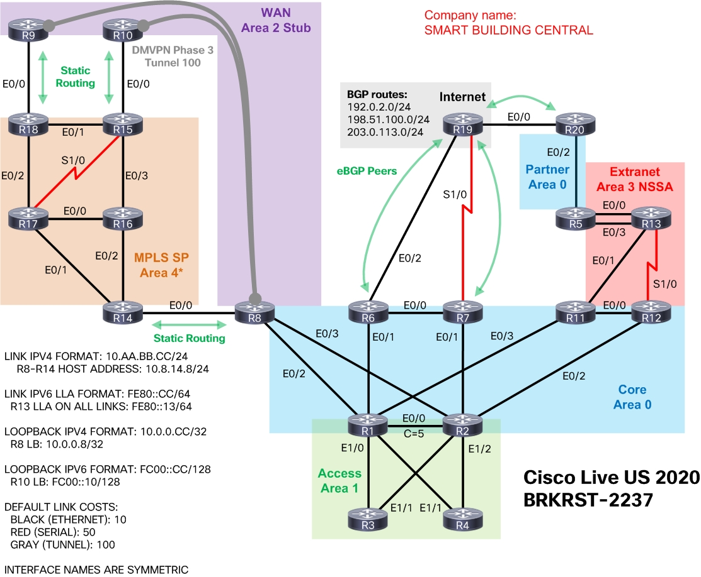

# OSPF Deployment in Modern Networks (DIGRST-2337)
Welcome to the Github repository for the lab demonstration!

> Contact information:\
> Email:    njrusmc@gmail.com\
> Twitter:  @nickrusso42518

## configs/
This folder contains configurations for the entire topology. It includes both
IPv4 (OSPFv2) and IPv6 (OSPFv3) features in all parts of the network.
completed.

## ping-scripts/
Collection of TCL scripts to run on subsets of routers to check
IPv4 and IPv6 connectivity. Use these after standing up the final
configs to ensure everything is working.

## Reference material
All of my Cisco Live sessions are easily accessible through my personal website.

> http://njrusmc.net/video/video.html

## Reference topology
Please reference this diagram when reviewing this Cisco Live session.

